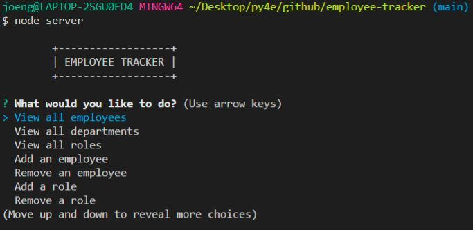
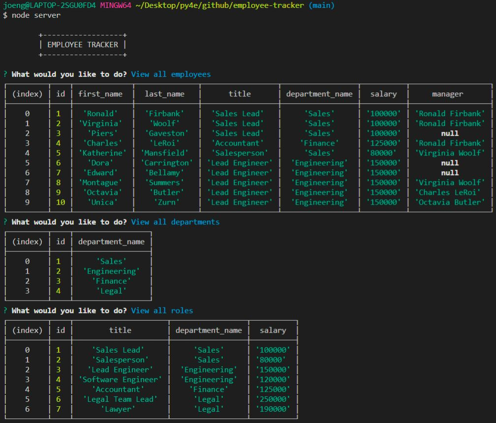

# Employee Tracker

# License
  

  

# Table of Contents

- [Description](#description)
- [Installation](#installation)
- [Usage](#usage)
- [Links](#links)
- [Questions](#questions)
- [Screenshot](#screenshot)

# Description
This is an employee tracker that let's users view the employee, department, and roles all in one database.  Powered by MySql, tables are created to organize and store data that was provided in the 'seeds.sql' file.  In order to operate this tracker, the user must use the terminal and activate it through the use of Node.  Screenshots are provided below.

# Built With
- Javascript
- NPM inquirer
- Bootstrap
- Node.js 

# Installation
Cloning of the repository is required.  This tracker is terminal based app.

# Usage 
- Clone the repository.
- Open terminal in root folder.
- Initiate node by typing "node server"
- View, add, remove and update employees, roles and departments.
- Walkthrough Screencastify: <a href="https://youtu.be/8iZ_L_OsArs">Click Me To Watch</a>

# Links
- Link to repository: https://github.com/itsrheine/employee-tracker

# Questions
If you have any questions or concerns, please feel free to reach out to my:
- Email: [mtiamsic@gmail.com](mtiamsic@gmail.com)
- Github: [itsrheine](https://github.com/itsrheine)

# Screenshot

  
